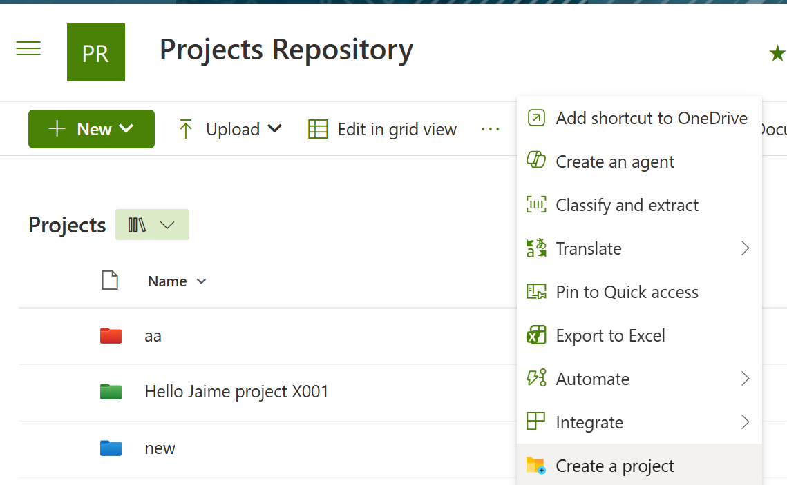
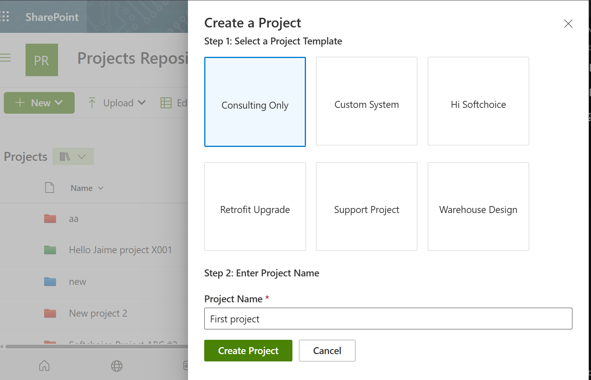
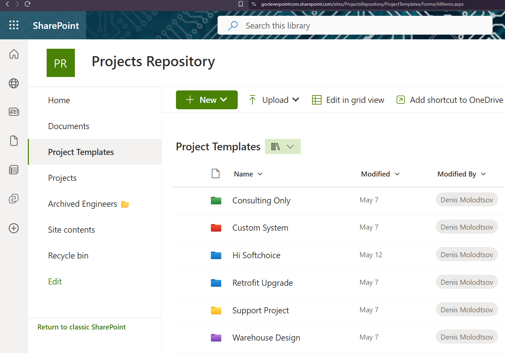
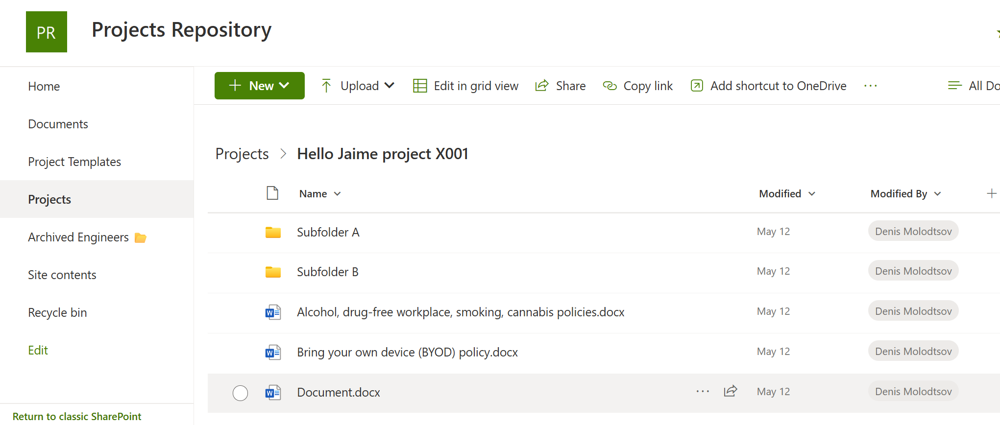
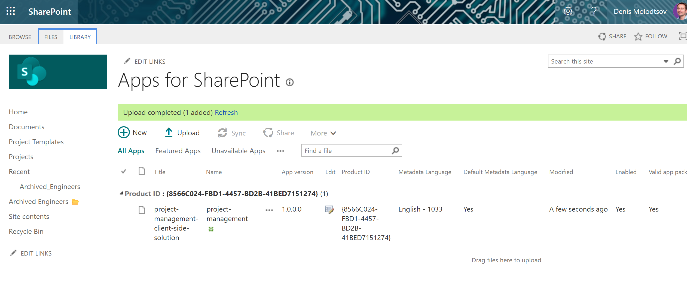
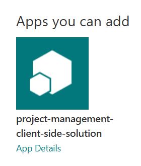

# Project management SPFX solution

## Node.js Version 22.14.0

## Summary

SPFX extension that adds the "Create a project" button to the command bar of a document library. This button allows users to create a new project site directly from the document library interface, streamlining project management and collaboration within SharePoint. The button is only available in the document library called "Projects". This can be changed in the code as needed.

The project folders are copied based on the document library called "Project Templates". Each folder there is a project template that can be used to create a new project folder. The entire structure of the template folder is copied to the new project folder, including all subfolders and files.

When a user clicks the "Create a project" button, a dialog box appears prompting them to enter the name of the new project. Once the user submits the form, a new folder is created in the "Projects" document library with the specified name, and the contents of the selected template folder are copied into it.

## Screenshots









## Used SharePoint Framework Version


## Applies to

- [SharePoint Framework](https://aka.ms/spfx)
- [Microsoft 365 tenant](https://docs.microsoft.com/en-us/sharepoint/dev/spfx/set-up-your-developer-tenant)

> Get your own free development tenant by subscribing to [Microsoft 365 developer program](http://aka.ms/o365devprogram)

## Prerequisites

> Node.js v22.14.0

## Solution

| Solution    | Author(s)                                               |
| ----------- | ------------------------------------------------------- |
| folder name | Author details (name, company, twitter alias with link) |

## Version history

| Version | Date             | Comments        |
| ------- | ---------------- | --------------- |
| 1.1     | March 10, 2021   | Update comment  |
| 1.0     | January 29, 2021 | Initial release |

## Disclaimer

**THIS CODE IS PROVIDED _AS IS_ WITHOUT WARRANTY OF ANY KIND, EITHER EXPRESS OR IMPLIED, INCLUDING ANY IMPLIED WARRANTIES OF FITNESS FOR A PARTICULAR PURPOSE, MERCHANTABILITY, OR NON-INFRINGEMENT.**

---

## Minimal Path to Awesome

- Clone this repository
- Ensure that you are at the solution folder
- in the command-line run:
  - **npm install**
  - **gulp serve**

> Notice that better pictures and documentation will increase the sample usage and the value you are providing for others. Thanks for your submissions advance.

> Share your web part with others through Microsoft 365 Patterns and Practices program to get visibility and exposure. More details on the community, open-source projects and other activities from http://aka.ms/m365pnp.

## References

- [Getting started with SharePoint Framework](https://docs.microsoft.com/en-us/sharepoint/dev/spfx/set-up-your-developer-tenant)
- [Building for Microsoft teams](https://docs.microsoft.com/en-us/sharepoint/dev/spfx/build-for-teams-overview)
- [Use Microsoft Graph in your solution](https://docs.microsoft.com/en-us/sharepoint/dev/spfx/web-parts/get-started/using-microsoft-graph-apis)
- [Publish SharePoint Framework applications to the Marketplace](https://docs.microsoft.com/en-us/sharepoint/dev/spfx/publish-to-marketplace-overview)
- [Microsoft 365 Patterns and Practices](https://aka.ms/m365pnp) - Guidance, tooling, samples and open-source controls for your Microsoft 365 development

## Build the project

```cmd
gulp clean ; gulp bundle --ship ; gulp package-solution --ship
```

## Deploy the package

- Create site collection app catalog if you don't have one already:

```powershell
Add-SPOSiteCollectionAppCatalog -Site https://contoso.sharepoint.com/sites/project_site_of_your_choice
```
- upload the generated .sppkg file from the `sharepoint/solution` folder to the site collection app catalog's "Apps for SharePoint" library



- Site contents -> Add an app -> select the  app

